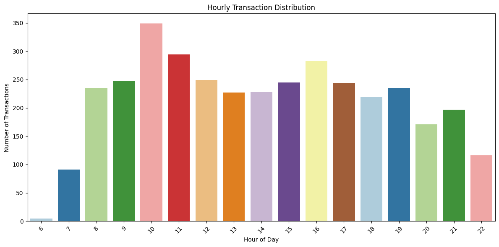
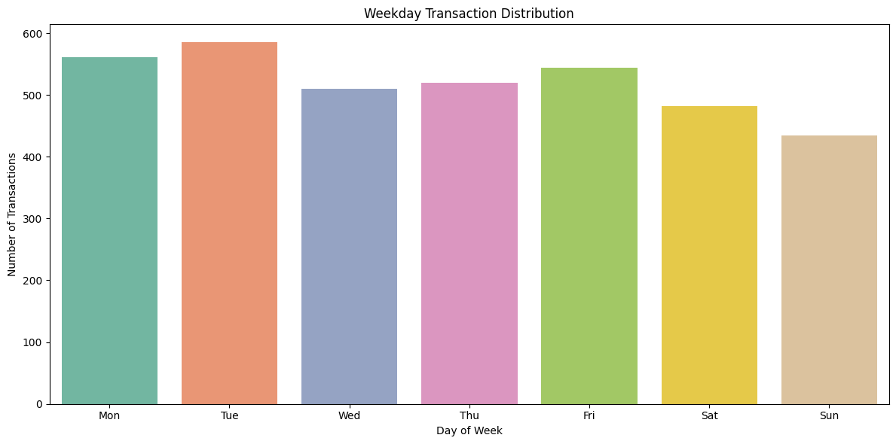

# ☕ Coffee Shop Sales Analysis

This project analyzes transaction data from a local coffee shop to uncover key business insights such as sales trends, customer preferences, and peak business hours.

The goal is to demonstrate practical data analytics skills using Python and Jupyter Notebook — focusing on cleaning, visualizing, and interpreting real-world sales data.

## 📊 Dataset Overview

The dataset contains 3,636 coffee shop transactions with the following columns:

- `date`: Sale date
- `datetime`: Timestamp of the transaction
- `cash_type`: Payment method (e.g., Cash, Card)
- `card`: Card details (optional or missing for cash payments)
- `money`: Amount paid
- `coffee_name`: Name of the coffee purchased

## ❓ Key Questions Explored

- What are the most popular coffee types?
- When is the shop busiest (time of day, day of week)?
- What is the distribution of payment methods?
- How much revenue is generated daily or weekly?
- Are there any observable trends over time?

## 🚀 Getting Started

To view or run the notebook:

1. Clone the repo: git clone --
2. Open `coffee_shop_analysis.ipynb` in Jupyter Notebook or VS Code.

## 🔍 Key Insights

- The most sold coffee type was Americano with Milk followed by Latte and then Americano(black)
- Sales peaked between 9 AM and 11 AM.
- Weekly sales peaked on Tuesday closely followed by Monday and Friday
- March stands out with the highest number of transsctions followed by october
- Card payments accounted for 97.6% of transactions.
- Average revenue per day was around $302.97.

## ✅ Conclusion

This project demonstrates the use of data analysis techniques to help small businesses make informed decisions. These insights can guide inventory management, marketing, and staffing schedules.

## 📈 Future Work

- Incorporate customer data for loyalty insights
- Add product cost data to analyze profit margins
- Build a dashboard with Streamlit for real-time tracking

## 🖼️ Sample Visualizations

